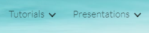

LDMS Users Group Conference (LDMSCON)
###########
The LDMS Users Group Conferences (LDMSCON) serves as a forum for users to share experiences with the LDMS product.

About
**********
You can find the general information and previous conferences following webpage: 
`LDMS Users Group Conference`_.

.. _LDMS Users Group Conference: https://sites.google.com/view/ldmscon

LDMSCON2021
************
Recordings of previous presentations, tutorials and information for LDMSCON2021 can be found here:
`LDMSCON2021 <https://sites.google.com/view/ldmscon2021>`_

* The tutorial videos and slides can be viewed under the "Tutorials" tab at the top right.
* The presentation videos and slides can be viewed under the "Presentations" tab at the top right.

LDMSCON2020
************
Recordings of previous presentations, tutorials and information for LDMSCON2020 can be found here:
`LDMSCON2020 <https://sites.google.com/view/ldmscon2020>`_

* The tutorial videos and slides can be viewed under the "Tutorials" tab at the top right.
.. image:: images/ldmscon/ldmscon2020tutoriallink.png
   :width: 200

LDMSCON2019
************
The website for LDMSCON2019 can be found here:
`LDMSCON2019 <https://sites.google.com/view/ldmscon2019>`_

LDMSCON2019 was hosted in-person so there are no video recordings of this conference. 

